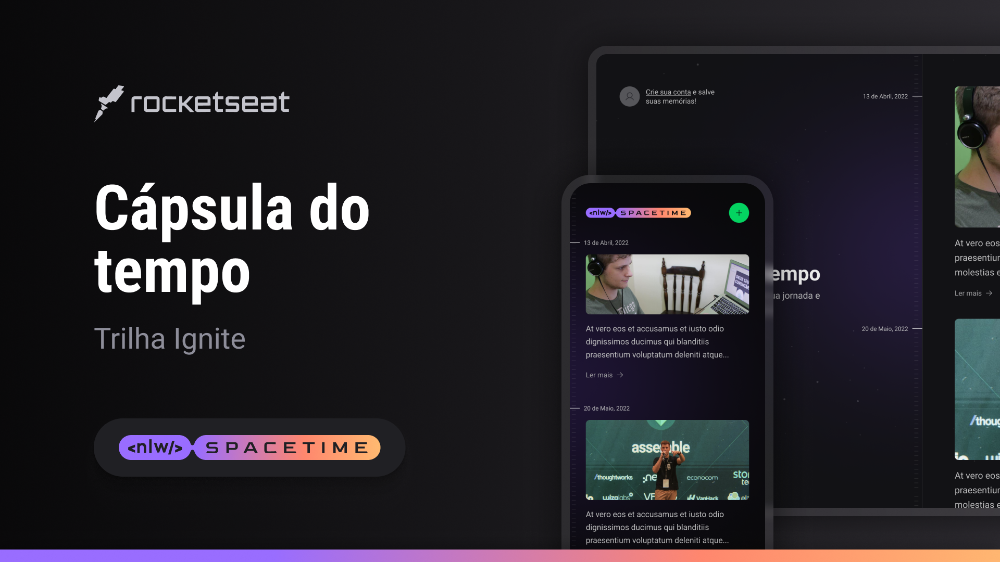

<p align="center">
  
</p>

<!-- <p align="center">
  <a href="#-tecnologias">Tecnologias</a>&nbsp;&nbsp;&nbsp;|&nbsp;&nbsp;&nbsp;
  <a href="#-layout">Layout</a>&nbsp;&nbsp;&nbsp;|&nbsp;&nbsp;&nbsp;
  <a href="#memo-licença">Licença</a>
</p> -->

# 🚀 NLW Spacetime Project - Memory Recall

Capsula do Tempo is a web and mobile application that allows users to store and view their memories and memories. The project was developed using NextJS for the frontend, Node.js with Fastify for the backend and React Native for the mobile version. Users can log in using their GitHub account, accessing all of their existing memories and registering new memories.

This project is part of the NLW Spacetime Ignite trail promoted by RocketSeat in May 2023.


## Features

- Login via GitHub for secure authentication.
- Visualization of all memories registered by the user.
- Registration of new memories, including text and photos.


## Installation
```
yarn install
```

```
yarn dev
```

```
yarn start
```

<a id="-tech"></a>

## Tech Stack
 <p align="center">
	 
	
	
	
	
	
	
	
	
	
</p>

- [x] TypeScript
- [x] ReactJS
- [x] Next
- [x] Vite
- [x] Tailwind
- [x] DayJS
- [x] Radix
- [x] Axios

## Version

- Version 1.0 (alpha)

<a id="-special-thanks"></a>

## Special Thanks
<p align="center"> 
	
</p>

<p align="center">
	<h2>Special thanks to the entire Rocketseat team for providing this experience.</h2>
</p>

